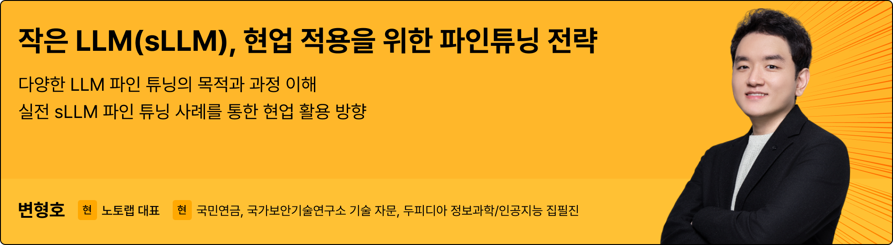

# 변형호(Hyungho Byun)

**AI Agent, LLM 파인 튜닝, RAG, Context Engineering까지 생성 AI를 실무에 적용하는 방법을 깊이 있게 전달합니다.**

## 📘 Bio

- 2010.2 경기과학고등학교 조기졸업
- 2016.2 한국과학기술원 전산학부 학사 졸업 (부전공: 수리과학부)
- 2023.2 서울대학교 컴퓨터공학부 박사 졸업
 
안녕하세요! 노토랩 대표 변형호입니다.

노토랩은 Agent, 파인 튜닝, RAG, 멀티모달리티와 같이 다양한 LLM의 문제들을 연구하고 해결합니다.  
2026년에는 멀티캠퍼스 AI/자연어처리 과정과 삼성SDS, 삼성전자, LG EXAONE, LG CNS, 신한라이프 대상 AI Agent/RAG 및 파인 튜닝 강의를 진행하고 있으며,   
최신 논문 리뷰 및 세미나, 맞춤형 교육 설계나 개발 자문도 진행합니다.  
LinkedIn에서 연구 동향과 최신 인사이트도 공유합니다.

## Featured

### 2026. 1
유튜브 채널 SudoRemove "DeepSeek Engram 페이퍼 리뷰"

[텍스트 버전(링크드인)](https://www.linkedin.com/feed/update/urn:li:activity:7416984900010090496/)

### 2025

<table>
  <tr>
    <td align="center" width="50%">
      
       <b>Mixture of Experts</b>
       유튜브 SudoRemove | <a href="https://bustling-pea-9a9.notion.site/Mixture-of-Experts-MoE-28193e636af1809ca756cbacea186bf6">발표자료</a>
    </td>
    <td align="center" width="50%">
      
       <b>Long-Context Attention과 Qwen-3-Next</b>
       유튜브 SudoRemove | <a href="https://bustling-pea-9a9.notion.site/Attention-Long-Context-DeltaNet-Mamba2-Qwen-3-Next-28493e636af18003a88ddc39d37cf110">발표자료</a>
    </td>
  </tr>
  <tr>
    <td align="center">
      
       <b>LLM 최신 모델 동향: 추론과 멀티모달</b>
       국가보안기술연구소 초청 세미나 | <a href="https://drive.google.com/file/d/127f-7tZgekg0czfEz5kHOnc717JVjyp1/view?usp=sharing">발표자료</a>
    </td>
    <td align="center">
      
       <b>LLM 개발과 파인 튜닝</b>
       패스트캠퍼스 X 경기도 판교 일할맛 세미나 | <a href="https://fastcampus.co.kr/sem_mat_06">상세페이지</a>
    </td>
  </tr>
  <tr>
    <td align="center" colspan="2">
      
       <b>LLM의 새로운 전환점, Reasoning 모델 이해하기 (Feat. DeepSeek R1)</b>
       노토랩 변형호 X 테디노트 | <a href="https://drive.google.com/file/d/1gQDdRkjhrHiEA27eOPPiW6nXzpa3-Hh4/view?usp=sharing">강의자료 PDF</a>
    </td>
  </tr>
</table>

---

## 🎒Courses & Activities

### 2026
- 멀티캠퍼스 AI/자연어처리 오프라인 강의
  - **[<1Day 생성형 AI와 LLM의 이해>](https://m.multicampus.com/course/crsDetail?corsCd=FA01KS)**

  - **[<LLM 파인튜닝 마스터, 생성형 AI 기초부터 SFT, PEFT까지>](https://m.multicampus.com/course/crsDetail?corsCd=FA01KP)**
  - **[<LLM 파인튜닝 마스터, sLLM 기반의 어플리케이션 만들기>](https://m.multicampus.com/course/crsDetail?corsCd=FA01KQ)**
  - **[<LLM 파인튜닝 마스터, 주요 예제로 배우는 LLM 응용 기술>](https://m.multicampus.com/course/crsDetail?corsCd=FA01KR)**
    
  - **[<LLM 마스터, LangGraph와 MCP로 AI Agent 개발하기>](https://m.multicampus.com/course/crsDetail?corsCd=FA01KW)**

- 현대모비스 - LLM 프로젝트 특화 교육
    - **LLM 파인 튜닝: CPT, IT, DPO, GRPO, Tool Calling 특화 파인튜닝**
    - **Context Engineering: RAG, Agent, MCP, Memory, Skills**
    - **LLM 평가와 최적화: LangFuse를 이용한 Tracing/Evaluation/Tracking**
    - **LLM In-Depth Knowledge**

- LG EXAONE - 파인 튜닝 교육
    - **Agent를 위한 합성 데이터 생성**
    - **Agent 특화 PEFT 파인튜닝**
    - **GRPO를 통한 Agent 성능 향상**

- SK 그룹 역량강화교육 - 파인튜닝 강의
    - **Ollama와 vLLM을 이용한 오픈 LLM 서빙 및 고속 추론**
    - **HuggingFace 공개 모델 로딩과 파인 튜닝을 위한 합성 데이터 생성**
    - **Continuous Pretraining(CPT)을 통한 도메인 지식 주입과 도메인 코퍼스 구성**
    - **Instruction Data, LoRA, Rejection Sampling + SFT, DPO 기반 모델 성능 향상**
    - **LLM Tool Calling, LangChain Agent, Tool Calling 데이터 생성 및 Agent 특화 파인 튜닝**

- 삼성SDS 온라인 강의 제작 - LLM Agent 실전 마스터
    - **LLM Agent를 이용한 Workflow 설계**
    - **Claude Code를 이용한 Agent 개발**
    - **다양한 Agent Orchestration Framework 소개**
    - **Agent 고도화 기술: Context Engineering, Long-Term Memory, Agent Skills**

- 삼성SDS - RAG 개발 심화 강의 (2025~)   
    - **LangChain을 이용한 Workflow 구성**
    - **Retrieval Augmented Generation (RAG)**
    - **LangChain Agent 개발**
      
- 삼성전자 'MCP를 이용한 AI 에이전트 개발' (2025~)
- 삼성전자 'AI Agent의 성능 평가와 검증'
      
- LG CNS - AI Agent 개발 강의
    - AI Agent 기본
    - Context Engineering
    - Agent Memory
    - Agent Skill

- 신한라이프 - LLM Agent 개발 강의
    - LLM API 기반 어플리케이션
    - LangChain과 Agent를 이용한 에이전트
    - Model Context Protocol
    - LangChain 1.0의 Agent 구조와 Multi Agent
    - Deep Agent

### 2025

- 멀티캠퍼스 이러닝 강의 제작
  - **[<LLM과 LangChain을 이용한 RAG 어플리케이션 개발>](https://www.multicampus.com/em/enrolment/courseDetai?p_menu=NzUjU1VC&p_gubun=Qw==&dxLanYn=N&corsCd=EA0DH1&corsYr=2020&corsDgrCd=10001)**
  - **[<LLM 파인 튜닝과 PEFT>](https://www.multicampus.com/em/enrolment/courseDetai?p_menu=NzUjU1VC&p_gubun=Qw==&dxLanYn=N&corsCd=EA0DH2&corsYr=2020&corsDgrCd=10001)**
  - **[<LLM 파인 튜닝과 sLLM 만들기>](https://www.multicampus.com/em/enrolment/courseDetai?p_menu=NzUjU1VC&p_gubun=Qw==&dxLanYn=N&corsCd=EA0DH3&corsYr=2020&corsDgrCd=10001)**

- 패스트캠퍼스 온라인 강의 제작
    - **[<랭그래프로 한번에 완성하는 복잡한 RAG와 Agent>](https://fastcampus.co.kr/data_online_langgraph)**
      
- LG AI Research
    - **LLM 파인 튜닝 교육 영상 제작**
    - **EXAONE 파인 튜닝 오프라인 교육**

- 현대자동차그룹 연구소
    - **생성형 AI 실무 과정**
      
- 새마을금고중앙회
    - **LLM 파인 튜닝과 PEFT**
 
- 신한금융그룹
    - **금융 AI Agent 개발 교육** 
      
- 삼성전자 AI 교육
    - **MCP를 이용한 AI 에이전트 개발**
 
- 포항산업기술연구소(RIST) 기술 자문 세션
    - **업무 혁신을 위한 AI Agent 개발**
 
- 삼성전자 AI Essential 과정
    - **AI 트렌드 세미나**

- 두피디아 정보과학/인공지능 분야 집필진 (2023.06-)    

- 삼성SDS - LLM 프로그래밍 강의(2024~)   
    - **OpenAI API와 Assistant 활용법 **
    - **LangChain과 LCEL(LangChain Expression Language) 개발**
    - **Retrieval Augmented Generation (RAG)**
      

<b>2024</b>

- 국가보안기술연구소 LLM 개발 기술 자문
    - **Agentic Work 자동화 프로젝트**

- 국가보안기술연구소 LLM 교육
    - **Large Language Model과 보안**

- KT AI 연구소 세미나
    - **2024 ACL Conference 리뷰 및 Hands-on Session**
    - **2024 Microsoft AI Research 리뷰 및 Hands-on Session**

- 삼성SDS - LLM 프로그래밍 강의   
    - **OpenAI API와 Assistant 활용법 **
    - **LangChain과 LCEL(LangChain Expression Language) 개발**

- 한전KDN LLM/AI 교육
    - **프롬프트 엔지니어링과 OpenAI API**
    - **LangChain을 이용한 어플리케이션 만들기**
    - **멀티모달 모델 이해하기**

- SK Telecom - AI Literacy  Program 강의   
    - **ChatGPT와 LLM 파인튜닝  **
    - **LangChain 심화 **

- 신한금융투자 - 생성형 AI 모델 R&D 기반 구성 수행 강의  
    - **금융 데이터 파인 튜닝 LLM **
    - **생성AI 기반 마케팅 문구 생성 및 영상 요약 어플리케이션 **

- GS그룹 LLM 프로그래밍 심화 교육
    - **LLM 파인튜닝 및 sLLM 개발 **
    - **RAG 성능 고도화 방법**
    - **효과적인 LLM 어플리케이션 서빙하기**

- 아주대학교 ChatGPT 활용 교육
- 신세계디에프 생성형AI 활용 교육
- 한국앤컴퍼니 생성형AI 활용 교육

- HL그룹 생성형AI 활용 교육

- 삼성전자 신입사원 Digital Transformation 교육 (2024.03-2024.04)
    - **Python을 이용한 데이터분석 및 시각화**
    - **ChatGPT와 LangChain을 활용한 업무 생산성 향상**
    - **SQL 데이터베이스**

- 중소기업벤처진흥공단 스타트업 AI기술인력 양성(이어드림 스쿨) 멘토
    - 프로젝트 과제 개발 자문
- 현대엘리베이터 LLM 세미나 'AI와 IT 기술 트렌드'

<b>2023</b>

- HD현대 : 과학기술정보통신부-정보통신산업진흥원 주관 산업전문인력 AI 역량 강화 사업 강의(2023)
    - **거대 언어 생성 모델(LLM)을 활용한 현장 매뉴얼 가이드 챗봇  **
- 삼성전자-패스트캠퍼스 Citizen Developer 과정 교육 (2023)
    - **Python 데이터 전처리  **

- 과학기술정보통신부-정보통신산업진흥원 주관 산업전문인력 AI 역량 강화 사업 강의 (2022)
    - **설비 센서 데이터를 활용한 나노/탄소 소재 생산공정 설비 이상 예측**
    - **머신러닝을 활용한 소재·부품 생산공정 최적화**
    - **나노/탄소 잉크기반 잉크젯 공정 라인두께 예측  **
- 삼성전자 신입사원 Digital Transformation 교육 (2023.02-2024.04)
    - **Python을 이용한 데이터분석 및 시각화**
    - **머신러닝/ 딥러닝 기초**
    - **ChatGPT를 활용한 업무 생산성 향상**
    - **현업 데이터를 활용한 인공지능 프로젝트  **

 
      
  

<b>📖 Publication</b>

- Aspect-Oriented Unsupervised Social Link Inference on User Trajectory (주저자)
    - Elsevier Information Sciences, 2023.  
- SC-Com: Spotting Collusive Community in Opinion Spam Detection (주저자)
    - Elsevier Information Processing & Management, 2021. 
- When friends move: A deep learning-based approach for friendship prediction in mobility network (Poster) (주저자)
    - International Conference on Mobile Systems, Applications, and Services (MobiSys),2019. 
- Graph-Enhanced Unsupervised Social Link Inference for User Trajectory Data (Submitted) (주저자)
    - IEEE International Conference on Web Services (ICWS), 2023. 
- Finding Heterophilic Neighbors via Confidence-based Subgraph Matching for Semi-supervised Node Classification, (공저자)
    - ACM International Conference on Information & Knowledge Management (CIKM),2022. 
- Based Domain Disentanglement without Duplicate Users or Contexts for Cross-Domain Recommendation, (공저자)
    - ACM International Conference on Information & Knowledge Management (CIKM),2022. 
- Dynamic graph convolutional networks with attention mechanism for rumor detection on social media (공저자)
    - PLOS ONE, 2021. 
- Toward efficient dynamic virtual network embedding strategy for cloud networks (공저자)
    - International Journal of Distributed Sensor Networks, 2018. 

## 🛠️ Tools

